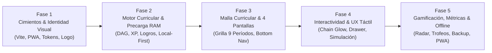

# Roadmap y Fases de Desarrollo — Mi Malla (PWA)

Documento maestro con la especificación detallada de las 5 fases de construcción de la aplicación web progresiva **Mi Malla**, basada en una arquitectura **Local-First**, diseño en **Modo Claro (Clean & Warm Light)** y sistema de gamificación estilo **Skill Tree / RPG**.

---

## 🧭 Resumen del Flujo de Construcción

---

## 🧱 Fase 1: Cimientos del Proyecto e Identidad Visual (✅ COMPLETADA)

### Objetivo
Establecer la estructura base del proyecto con **Vite + React**, el sistema de diseño (Modo Claro oficial + variables de Modo Oscuro opcional) y los activos PWA instalables.

### Tareas Técnicas
1. **Scaffolding del Proyecto**:
   - Inicializar la aplicación con **Vite + React + TypeScript** en `app/` (o raíz modular).
   - Instalar dependencias esenciales:
     - `dexie` & `dexie-react-hooks` (persistencia Local-First reactiva sobre IndexedDB).
     - `zod` (validación de esquemas runtime de datos y estados).
     - `recharts` (panel gráfico de radar/analíticas).
     - `react-hook-form` (formulario ligero del Drawer de materia).
     - `framer-motion` (física de animaciones y micro-interacciones).
     - `lucide-react` (iconografía lineal clara de 1.75px–2px).
     - `canvas-confetti` (celebración de logros e hitos mayores).
     - `vite-plugin-pwa` (Service Worker Workbox, manifiesto e instalación nativa).
     - `vitest` + `@testing-library/react` (entorno de pruebas unitarias).
2. **Sistema de Diseño Base (`index.css`)**:
   - Configuración de tokens CSS oficiales en **Modo Claro** (Clean & Warm Light) e infraestructura para **Modo Oscuro opcional**:
     - `--color-slate-light`: `#A4ADBF` (bordes suaves, tarjetas bloqueadas).
     - `--color-slate-mid`: `#7A98BF` (badges de área, materias en curso).
     - `--color-steel`: `#6D86A6` (estructura, íconos, subtítulos).
     - `--color-sand`: `#D9D3C7` (fondos secundarios, acentos suaves).
     - `--color-terracotta`: `#73482F` (acento protagónico: completadas, botones, XP).
     - `--bg-main`: `#F8F7F4` (fondo general marfil/arena claro).
     - `--bg-card`: `#FFFFFF` (tarjetas limpias con elevación sutil).
     - `--bg-card-muted`: `#EFECE6` (tarjetas inactivas/niebla).
     - `--text-primary`: `#232B38` (alto contraste y legibilidad).
     - `--text-secondary`: `#5A6B82`.
   - Tipografía moderna desde Google Fonts (Outfit / Inter).
3. **Identidad Visual y Logo**:
   - Isotipo vectorial SVG: red geométrica interconectada en Terracota (`#73482F`) con nodos en Azul Acero (`#6D86A6`) sobre fondo marfil claro (`#F8F7F4`).
   - Generación de iconos PWA (`192x192` y `512x512` px) con márgenes seguros para Android e iOS.
   - Configuración del manifiesto (`manifest.webmanifest`) con `display: "standalone"`, `theme_color: "#F8F7F4"` y pantalla de bienvenida (*Splash Screen*).

### Entregable Tangible
Aplicación ejecutándose localmente (`npm run dev`), con diseño claro cargado, lista para instalarse en el smartphone con su icono oficial.

---

## 🧠 Fase 2: Motor Curricular, Gamificación y Precarga en Memoria RAM (✅ COMPLETADA)

### Objetivo
Construir el núcleo lógico independiente de la interfaz de usuario, garantizando latencia cero ($O(1)$) y funcionamiento 100% desconectado con persistencia robusta mediante **Dexie.js** y validación **Zod**.

### Tareas Técnicas
1. **Precarga en Memoria RAM & Validación Zod**:
   - Implementar `src/lib/curriculumEngine.ts`.
   - Validar `seed_data.json` en tiempo de ejecución con esquemas de **Zod** (`ZCourse`, `ZPeriod`, `ZLearningField`).
   - Parsear e indexar materias, prerrequisitos y áreas en estructuras de datos en memoria (`Map` y `Set` de JavaScript).
   - Consultas instantáneas a 0 ms para dependencias, bloqueos y créditos.
2. **Algoritmo de Grafo de Prerrequisitos (DAG Traversal)**:
   - Lógica de desbloqueo dinámico: una materia se desbloquea únicamente cuando todos sus requisitos previos de tipo `R` están en estado `completed`.
   - **Recálculo en Cascada (Rollback Seguro)**: desmarcar una materia aprobada re-bloquea automáticamente todas sus materias sucesoras y ajusta la XP en tiempo real.
   - **Manejo de Materias Reprobadas (`failed`)**: soporte de estado no punitivo (*"Por nivelar / Repetir"*), manteniendo bloqueadas sus dependencias.
   - Soporte para materias sin prerrequisitos en semestres altos (respeto estricto a la fuente oficial).
   - Manejo diferenciado de pruebas diagnósticas de 0 créditos (`category: 'diagnostic'`).
3. **Motor de Gamificación & Curva de Niveles (`src/lib/gamificationEngine.ts`)**:
   - Conversión de XP: `1 Crédito Académico = 100 XP` (Profundización = 800 XP; Pénsum total = 15,800 XP).
   - **Curva de experiencia progresiva/exponencial** en 10 Niveles para mantener alta motivación en semestres avanzados.
   - Lógica de evaluación en tiempo real del catálogo dinámico de logros en formato JSON/TS (`id`, `criteriaFn`).
4. **Persistencia Local-First Robusta con Dexie.js (`src/lib/db.ts`)**:
   - Base de datos IndexedDB estructurada con **Dexie.js** (resistente a purgas de iOS Safari WebKit).
   - Tabla `user_course_status` indexada por `course_id` y `status`.
   - Sincronización asíncrona reactiva mediante `useLiveQuery` de Dexie sin congelar la UI.

### Entregable Tangible
Suite lógica validada con pruebas unitarias en **Vitest** (`npm run test`) que comprueban desbloqueo del grafo, rollback seguro, curva de XP y persistencia en IndexedDB.

---

## 🗺️ Fase 3: Grilla Curricular y Arquitectura Multi-pantalla (4 Vistas) (✅ COMPLETADA)

### Objetivo
Desplegar la estructura visual completa de la aplicación, el sistema de navegación por vistas y la presentación del árbol de materias en los 9 períodos con ergonomía móvil.

### Tareas Técnicas
1. **Navegación Multi-pantalla y Ergonomía Móvil**:
   - Implementación de la **Barra de Navegación Inferior (Bottom Nav)** fija para móviles con íconos lineales claros y soporte de **Zona Segura (`padding-bottom: max(12px, env(safe-area-inset-bottom))`)** para iPhone y Android gestual.
   - Modo responsivo para escritorio: diseño panorámico dividido (*Master-Detail*) con la malla a la izquierda y el panel de análisis a la derecha.
2. **Las 4 Pantallas Especializadas**:
   - `🗺️ Pantalla 1: Malla Curricular (Skill Tree)`: grilla con scroll snap horizontal para los 9 períodos, píldoras superiores de salto rápido (`1` al `9`) y botón de **Onboarding Rápido ("Completar Semestre")** en cabeceras de columnas para estudiantes avanzados.
   - `🏆 Pantalla 2: Vitrina de Logros y Rangos (Trophies)`: escaparate de medallas (bronce, plata, oro, platino, diamante) y rango académico actual.
   - `📊 Pantalla 3: Métricas y Radar de Habilidades (Analytics)`: panel de control interactivo con gráfico de **Radar (Recharts)** por área temática y porcentaje global de grado.
   - `⚙️ Pantalla 4: Perfil, Simulación y Respaldo (Settings)`: herramientas de exportación/importación, selector de tema (Modo Claro / Modo Oscuro) y opciones generales.
3. **Componente de Materia (`CourseCard`) y Contraste Solar**:
   - Metáfora visual de nodo RPG en Tema Claro con títulos en `--text-primary: #232B38` (`font-weight: 600`) para legibilidad óptima bajo la luz del sol (WCAG AAA):
     - *Bloqueada*: Fondo `#EFECE6`, borde tenue `#A4ADBF`, candado discreto.
     - *Desbloqueada*: Fondo `#FFFFFF`, borde definido, lista para cursar.
     - *En Curso*: Borde y acento en Azul Acero (`#7A98BF`).
     - *Aprobada*: Borde y detalles en Terracota (`#73482F`) con check de maestría.
     - *Por Nivelar*: Badge amigable para materias reprobadas (`failed`).
   - Badges visuales por `category` y área académica (`learning_field`).
4. **Header Superior con Barra de XP**:
   - Barra de nivel del estudiante con animación fluida de llenado en color Terracota.

### Entregable Tangible
Navegación fluida entre las 4 vistas, soporte solar de alto contraste y grilla interactiva con gráfico Radar funcional.

---

## ⚡ Fase 4: Interactividad Avanzada, Resaltado de Red y UX Táctil (✅ COMPLETADA)

### Objetivo
Dar vida a la aplicación con animaciones fluidas, enfoque táctil ergonómico para móviles, protección contra toques accidentales y herramientas de inspección.

### Tareas Técnicas
1. **Prevención de Toques Accidentales (*Scroll Guard*)**:
   - Umbral de movimiento táctil (*scroll threshold*) de `8px` para evitar que un deslizamiento de scroll se confunda con un tap de marcado.
2. **Resaltado Direccional en Cadena (*Chain Glow*) Optimizado**:
   - Implementado mediante **filtros CSS de rendimiento optimizado** (`filter: drop-shadow`) y clases dinámicas:
     - **Hacia atrás (Requisitos previos requeridos)**: Iluminadas en tono **Arena (`#D9D3C7`)** con indicador `← Requisito`.
     - **Hacia adelante (Materias que desbloquea)**: Iluminadas en **Terracota (`#73482F`)** con pulso suave `→ Desbloquea`.
   - Tocar cualquier espacio neutro desactiva de inmediato el resplandor.
3. **Acción Rápida de Estado & Notificación de Deshacer (*Undo*)**:
   - Botón de acción explícito en la tarjeta para alternar estado (`completed`, `in_progress`, `pending`, `failed`) con micro-animaciones en `framer-motion`.
   - **Toast temporal de 5 segundos con botón "Deshacer" (Undo)** ante cualquier cambio accidental.
   - Confirmación amigable si desmarcar una materia re-bloqueará materias posteriores en cascada.
4. **Drawer / Inspector Lateral con `react-hook-form`**:
   - Panel lateral deslizante con desglose completo de la materia: código, créditos, horas (HT/HP/HTP), prerrequisitos y nota referencial.
   - **Personalización de Electivas**: campo de texto libre para ingresar el nombre real de la electiva cursada (ej. *"Comercio Electrónico"*).
5. **Modo Simulación ("What-If")**:
   - Interruptor para activar un entorno de pruebas (*sandbox*): permite marcar materias ficticiamente para ver qué se desbloquearía en los semestres siguientes sin alterar los datos reales guardados en Dexie.

### Entregable Tangible
Malla interactiva blindada contra toques accidentales, iluminación direccional fluida de alto rendimiento, sistema de deshacer en 5 segundos y simulador de escenarios.

---

## 🏆 Fase 5: Gamificación Completa, Métricas, Backup y PWA Offline (✅ COMPLETADA)

### Objetivo
Conectar el sistema de recompensas con dosificación elegante (cero ruidos ni interrupciones), asegurar la portabilidad de los datos y certificar el funcionamiento offline de la PWA.

### Tareas Técnicas
1. **Dashboard y Gráfico Radar (Recharts)**:
   - Gráfico de **Radar / Tela de araña** interactivo mostrando el balance de competencias por área temática (Finanzas, Talento Humano, Mercadeo, Métodos Cuantitativos, etc.).
   - Estadísticas de créditos aprobados vs. pendientes (sobre un total de **158 créditos**) y porcentaje hacia el grado.
2. **Vitrina de Logros & Celebración Dosificada (No Ruido / No Spam)**:
   - Aprobaciones individuales: micro-animación en barra de XP y vibración háptica suave (`15ms`).
   - Lluvia de confetti (`canvas-confetti`) y modales celebratorios reservados **exclusivamente para hitos mayores** (semestres completos, culminación de áreas temáticas o graduación). Sonidos silenciados por defecto para bibliotecas y aulas.
3. **Ficha de Avance / Modo Compartir**:
   - Generación estética de la **"Ficha de Estudiante / Tarjeta de Personaje"** con nivel RPG, porcentaje de avance y gráfico de radar, lista para descargar o compartir en redes sociales.
4. **Copia de Seguridad y Portabilidad (100% Offline)**:
   - Función **Exportar Progreso**: descarga instantánea de un archivo `.json` liviano con estados, notas y logros.
   - Función **Importar Progreso**: carga y restauración de datos para transferir el avance entre dispositivos (PC ↔ Smartphone) sin requerir servidores ni cuentas.
5. **PWA Offline y Optimización Final**:
   - Configuración de caché estática con Workbox en `vite-plugin-pwa`.
   - Pruebas de instalación nativa en Android (Chrome) e iOS (Safari "Añadir a pantalla de inicio").
   - Auditoría de rendimiento Lighthouse (PWA, Rendimiento, Accesibilidad y Mejores Prácticas).

### Entregable Tangible
Producto final completo, pulido, 100% funcional sin conexión a internet y listo para su uso diario por estudiantes universitarios.

---

## 🛡️ Matriz de Blindaje Técnico y Prevención de Fallas Tecnológicas

| Componente | Falla Potencial Detectada | Salvaguarda Técnica Implementada |
|---|---|---|
| **PWA & Viewport** | Barra de gestos de iPhone tapando el Bottom Nav | `<meta name="viewport" content="... viewport-fit=cover">` + `env(safe-area-inset-bottom)` |
| **Persistencia Dexie.js** | Saltos visuales por lectura asíncrona (*Hydration Race Condition*) | Estado `isHydrating: boolean` + *Skeleton Screen* inicial |
| **Grafo Curricular (DAG)** | Rollback incompleto al desmarcar antecedente | Algoritmo BFS/DFS de profundidad completa desmarcando toda la cadena descendiente |
| **Motor de Gamificación** | Deriva de puntos por contadores mutables (+100/-100) | XP calculada como **función pura**: `XP = sum(créditos completados) * 100` |
| **Modo Simulación** | Contaminación o autoguardado accidental en IndexedDB | Clon de estado desacoplado en RAM; escrituras a `db.put()` bloqueadas en simulación |
| **Importación Backup** | Corrupción de DB por JSON malformado o alterado | Validación runtime previa con esquema **Zod** (`ZUserProgressImport.parse(json)`) |
| **Analítica (Recharts)** | Error de renderizado `width: 0 / height: 0` por contenedor oculto | Renderizado condicional exclusivo cuando la pestaña activa es `analytics` |
| **Ficha Compartible** | Renderizado deforme en Canvas por fuentes no cargadas | Verificación de promesa `document.fonts.ready` antes del dibujo en Canvas |

