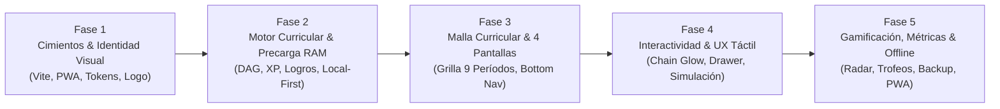

# Roadmap y Fases de Desarrollo — Mi Malla (PWA)

Documento maestro con la especificación detallada de las 5 fases de construcción de la aplicación web progresiva **Mi Malla**, basada en una arquitectura **Local-First**, diseño en **Modo Claro (Clean & Warm Light)** y sistema de gamificación estilo **Skill Tree / RPG**.

---

## 🧭 Resumen del Flujo de Construcción

---

## 🧱 Fase 1: Cimientos del Proyecto e Identidad Visual

### Objetivo
Establecer la estructura base del proyecto, el sistema de diseño en modo claro y los activos de identidad visual para que la app sea instalable y responsive desde el primer día.

### Tareas Técnicas
1. **Scaffolding del Proyecto**:
   - Inicializar la aplicación con **Vite + React** en la carpeta `app/`.
   - Instalar dependencias esenciales:
     - `framer-motion` (física de animaciones y micro-interacciones).
     - `lucide-react` (iconografía lineal clara de 1.75px–2px).
     - `canvas-confetti` (celebración de logros y semestres).
     - `vite-plugin-pwa` (Service Worker, manifiesto e instalación nativa).
2. **Sistema de Diseño Base (`index.css`)**:
   - Configuración de tokens CSS oficiales en **Modo Claro**:
     - `--color-slate-light`: `#A4ADBF` (bordes suaves, tarjetas bloqueadas).
     - `--color-slate-mid`: `#7A98BF` (badges de área, materias en curso).
     - `--color-steel`: `#6D86A6` (estructura, íconos, subtítulos).
     - `--color-sand`: `#D9D3C7` (fondos secundarios, acentos suaves).
     - `--color-terracotta`: `#73482F` (acento protagónico: completadas, botones, XP).
     - `--bg-main`: `#F8F7F4` (fondo general marfil/arena claro).
     - `--bg-card`: `#FFFFFF` (tarjetas limpias con elevación sutil).
     - `--bg-card-muted`: `#EFECE6` (tarjetas inactivas/niebla).
     - `--text-primary`: `#232B38` (alto contraste y legibilidad).
     - `--text-secondary`: `#5A6B82`.
   - Tipografía moderna desde Google Fonts (Outfit / Inter).
3. **Identidad Visual y Logo**:
   - Isotipo vectorial SVG: red geométrica interconectada en Terracota (`#73482F`) con nodos en Azul Acero (`#6D86A6`) sobre fondo marfil claro (`#F8F7F4`).
   - Generación de iconos PWA (`192x192` y `512x512` px) con márgenes seguros para Android e iOS.
   - Configuración del manifiesto (`manifest.webmanifest`) con `display: "standalone"`, `theme_color: "#F8F7F4"` y pantalla de bienvenida (*Splash Screen*).

### Entregable Tangible
Aplicación ejecutándose localmente (`npm run dev`), con diseño claro cargado, lista para instalarse en el smartphone con su icono oficial.

---

## 🧠 Fase 2: Motor Curricular, Gamificación y Precarga en Memoria RAM

### Objetivo
Construir el núcleo lógico independiente de la interfaz de usuario, garantizando latencia cero ($O(1)$) y funcionamiento 100% desconectado.

### Tareas Técnicas
1. **Precarga en Memoria RAM (In-Memory Hydration)**:
   - Implementar `src/core/curriculumEngine.js`.
   - Parsear `seed_data.json` e indexar materias, prerrequisitos y áreas en estructuras de datos en memoria (`Map` y `Set` de JavaScript).
   - Consultas instantáneas a 0 ms para dependencias, bloqueos y créditos.
2. **Algoritmo de Grafo de Prerrequisitos (DAG Traversal)**:
   - Lógica de desbloqueo dinámico: una materia se desbloquea únicamente cuando todos sus requisitos previos de tipo `R` están en estado `completed`.
   - **Recálculo en Cascada (Rollback Seguro)**: desmarcar una materia aprobada re-bloquea automáticamente todas sus materias sucesoras y ajusta la XP en tiempo real.
   - **Manejo de Materias Reprobadas (`failed`)**: soporte de estado no punitivo (*"Por nivelar / Repetir"*), manteniendo bloqueadas sus dependencias.
   - Soporte para materias sin prerrequisitos en semestres altos (respeto estricto a la fuente oficial).
   - Manejo diferenciado de pruebas diagnósticas de 0 créditos (`category: 'diagnostic'`).
3. **Motor de Gamificación (`src/core/gamificationEngine.js`)**:
   - Regla de conversión de XP: `1 Crédito Académico = 100 XP` (Profundización = 800 XP).
   - Escala de 10 Niveles de progreso (desde *Nivel 1: Recluta Universitario* hasta *Nivel 10: Administrador Legendario*).
   - Lógica de evaluación en tiempo real del catálogo de logros (Finanzas, Talento Humano, Diagnósticos, Semestres completos, etc.).
4. **Persistencia Local-First (Write-Through)**:
   - Guardado automático y asíncrono del estado del estudiante en `localStorage`.
   - Cualquier cambio se refleja de inmediato en la RAM y se sincroniza en segundo plano sin congelar la interfaz.

### Entregable Tangible
Suite lógica y pruebas unitarias/funcionales que validan el desbloqueo automático del grafo, cálculo de XP y detección de logros en tiempo récord.

---

## 🗺️ Fase 3: Grilla Curricular y Arquitectura Multi-pantalla (4 Vistas)

### Objetivo
Desplegar la estructura visual completa de la aplicación, el sistema de navegación por vistas y la presentación del árbol de materias en los 9 períodos.

### Tareas Técnicas
1. **Navegación Multi-pantalla y Ergonomía Móvil**:
   - Implementación de la **Barra de Navegación Inferior (Bottom Nav)** fija para móviles con íconos lineales claros y soporte de **Zona Segura (`padding-bottom: max(12px, env(safe-area-inset-bottom))`)** para iPhone y Android gestual.
   - Modo responsivo para escritorio: diseño panorámico dividido (*Master-Detail*) con la malla a la izquierda y el panel de análisis a la derecha.
2. **Las 4 Pantallas Especializadas**:
   - `🗺️ Pantalla 1: Malla Curricular (Skill Tree)`: grilla con scroll snap horizontal para los 9 períodos y píldoras superiores de salto rápido (`1` al `9`).
   - `🏆 Pantalla 2: Vitrina de Logros y Rangos (Trophies)`: escaparate de medallas (bronce, plata, oro, platino, diamante) y rango académico actual.
   - `📊 Pantalla 3: Métricas y Radar de Habilidades (Analytics)`: panel de control con distribución de créditos por área temática y porcentaje global de grado.
   - `⚙️ Pantalla 4: Perfil, Simulación y Respaldo (Settings)`: herramientas de exportación/importación y opciones generales.
3. **Componente de Materia (`CourseCard`)**:
   - Metáfora visual de nodo RPG en Tema Claro:
     - *Bloqueada*: Fondo `#EFECE6`, borde tenue `#A4ADBF`, candado discreto.
     - *Desbloqueada*: Fondo `#FFFFFF`, borde definido, lista para cursar.
     - *En Curso*: Borde y acento en Azul Acero (`#7A98BF`).
     - *Aprobada*: Borde y detalles en Terracota (`#73482F`) con check de maestría.
   - Badges visuales por `category` y área académica (`learning_field`).
4. **Header Superior con Barra de XP**:
   - Barra de nivel del estudiante con barra de progreso fluida en color Terracota.

### Entregable Tangible
Navegación completa entre las 4 vistas y visualización interactiva de los 9 semestres del programa de Administración de Empresas.

---

## ⚡ Fase 4: Interactividad Avanzada, Resaltado de Red y UX Táctil

### Objetivo
Dar vida a la aplicación con animaciones fluidas, enfoque táctil ergonómico para móviles y herramientas de inspección y simulación.

### Tareas Técnicas
1. **Resaltado en Cadena (*Chain Glow*)**:
   - Al tocar o pasar el cursor sobre cualquier materia, se iluminan con resplandor en tonos arena/terracota todas sus materias predecesoras (prerrequisitos) y sucesoras (materias que desbloquea a futuro).
2. **Acción Rápida de Estado**:
   - Micro-interacción táctil para conmutar el estado de la materia (`completed`, `in_progress`, `pending`, `failed`) con micro-animaciones en `framer-motion`.
3. **Drawer / Inspector Lateral de Asignatura**:
   - Panel lateral deslizante con el desglose completo de la materia: código, créditos, horas (HT/HP/HTP), prerrequisitos y nota referencial.
   - **Personalización de Electivas**: campo de texto para que el estudiante ingrese el nombre real de la electiva cursada (ej. *"Comercio Electrónico"*).
4. **Modo Simulación ("What-If")**:
   - Interruptor para activar un entorno de pruebas (*sandbox*): permite marcar materias ficticiamente para ver qué se desbloquearía en los semestres siguientes sin tocar el avance real guardado.

### Entregable Tangible
Malla interactiva con respuesta táctil inmediata, iluminación de caminos curriculares, inspector detallado y simulador de escenarios futuros.

---

## 🏆 Fase 5: Gamificación Completa, Métricas, Backup y PWA Offline

### Objetivo
Conectar el sistema de recompensas, afinar las métricas analíticas, asegurar la portabilidad de los datos y certificar el funcionamiento offline de la PWA.

### Tareas Técnicas
1. **Dashboard y Gráfico Radar**:
   - Implementación de gráfico de **Radar / Tela de araña** mostrando el balance de competencias por área temática (Finanzas, Talento Humano, Mercadeo, Métodos Cuantitativos, etc.).
   - Estadísticas de créditos aprobados vs. pendientes y porcentaje hacia el grado.
2. **Vitrina de Logros Activa & Recompensas**:
   - Alertas flotantes animadas tipo videojuego al desbloquear un logro o subir de nivel.
   - Lluvia de confetti personalizada con `canvas-confetti` (partículas en arena, terracota y acero) al completar un semestre o graduarse.
   - Micro-vibración háptica (`navigator.vibrate([15])`) en smartphones compatibles.
3. **Ficha de Avance / Modo Compartir**:
   - Generación estética de la **"Ficha de Estudiante / Tarjeta de Personaje"** con nivel RPG, porcentaje de avance y gráfico de radar, lista para descargar o compartir en redes sociales.
4. **Copia de Seguridad y Portabilidad (100% Offline)**:
   - Función **Exportar Progreso**: descarga instantánea de un archivo `.json` liviano con estados, notas y logros.
   - Función **Importar Progreso**: carga y restauración de datos para transferir el avance entre dispositivos (PC ↔ Smartphone) sin requerir servidores ni cuentas.
5. **PWA Offline y Optimización Final**:
   - Configuración de caché estática con Workbox en `vite-plugin-pwa`.
   - Pruebas de instalación nativa en Android (Chrome) e iOS (Safari "Añadir a pantalla de inicio").
   - Auditoría de rendimiento Lighthouse (PWA, Rendimiento, Accesibilidad y Mejores Prácticas).

### Entregable Tangible
Producto final completo, pulido, 100% funcional sin conexión a internet y listo para su uso diario por estudiantes universitarios.

